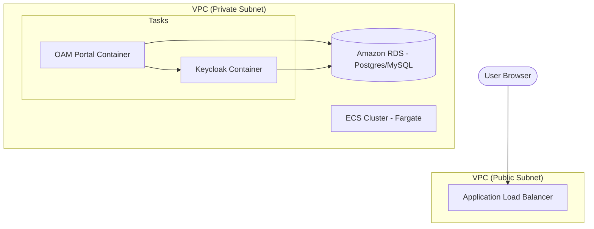

# AWS Installation Guide: OAM Portal Deployment

This guide outlines the steps to deploy the OAM (Operations, Administration, and Maintenance) Portal on AWS using Docker containers.

## Infrastructure Overview

We recommend using **Amazon ECS (Elastic Container Service) with Fargate** for serverless container orchestration, and **Amazon RDS** for persistent data storage.



---

## 1. Components & Configuration

### Application Stack
*   **Frontend/API**: Next.js 13.5 (Dockerized)
*   **Identity Provider**: Keycloak 22+ (Dockerized)
*   **Database**: Amazon RDS (Postgres 15+ recommended)
*   **Load Balancing**: AWS Application Load Balancer (ALB)
*   **Storage**: AWS ECR (Elastic Container Registry) for storing Docker images

---

## 2. Prerequisites

1.  **AWS Account** with administrative access.
2.  **AWS CLI** installed and configured.
3.  **Docker** installed locally.
4.  **Terraform or CloudFormation** (optional, for Infrastructure as Code).

---

## 2.1 Assumptions

*   **Existing Database**: This guide assumes that a **MySQL 8.0+** (or PostgreSQL) database instance is already provisioned and accessible within your VPC.
*   **Networking**: The database security group must allow inbound traffic from the ECS Tasks on port 3306 (MySQL) or 5432 (Postgres).

---

## 3. Preparation: Docker Images

### Building the OAM Portal Image
1.  Navigate to the project root.
2.  Build the production image:
    ```bash
    docker build -t oam-portal:latest .
    ```
3.  Authenticate with AWS ECR and push the image:
    ```bash
    aws ecr get-login-password --region <region> | docker login --username AWS --password-stdin <aws_account_id>.dkr.ecr.<region>.amazonaws.com
    docker tag oam-portal:latest <aws_account_id>.dkr.ecr.<region>.amazonaws.com/oam-portal:latest
    docker push <aws_account_id>.dkr.ecr.<region>.amazonaws.com/oam-portal:latest
    ```

---

## 4. Infrastructure Setup

### Security Groups
| Name | Inbound Rules | Outbound Rules |
| :--- | :--- | :--- |
| `alb-sg` | HTTP (80), HTTPS (443) from 0.0.0.0/0 | All traffic to `app-sg` |
| `app-sg` | Port 3000, 8080 from `alb-sg` | All traffic to `db-sg` |
| `db-sg` | Port 5432 from `app-sg` | None |

### Database (Amazon RDS)
1.  Create a **MySQL 8.0+** instance in the private subnet.
2.  Assign the `db-sg` security group.
3.  Create two databases: `oam_portal` and `keycloak`.
4.  **Initialize Schema**: Connect to the `oam_portal` database and run the initialization script provided in [`db/init.sql`](file:///home/guest/Desktop/Code/UIFrameWork/db/init.sql).

---

## 5. Deployment (ECS Fargate)

### Task Definitions
Create task definitions for both components using these environment variables:

#### OAM Portal (`app`)
| Variable | Value |
| :--- | :--- |
| `AUTH_MODE` | `keycloak` |
| `NEXTAUTH_URL` | `https://your-domain.com` |
| `NEXTAUTH_SECRET` | Generate a random 32-char string |
| `KEYCLOAK_ID` | `oam-portal-client` |
| `KEYCLOAK_SECRET` | From Keycloak Admin Console |
| `KEYCLOAK_ISSUER` | `https://your-domain.com/auth/realms/oam` |

#### Keycloak (`keycloak`)
| Variable | Value |
| :--- | :--- |
| `KC_DB` | `mysql` (or `postgres`) |
| `KC_DB_URL` | `jdbc:mysql://<rds-endpoint>:3306/keycloak` |
| `KC_DB_USERNAME` | `<rds-username>` |
| `KC_DB_PASSWORD` | `<rds-password>` |
| `KC_HOSTNAME` | `your-domain.com` |
| `KC_HTTP_RELATIVE_PATH` | `/auth` |

---

## 6. Access & Verification

1.  **ALB Listener**: Point HTTPS (443) targets to the ECS Service.
2.  **DNS**: Create an A-record (Alias) in Route53 pointing your domain to the ALB.
3.  **Keycloak Setup**: 
    - Access `https://your-domain.com/auth/admin`.
    - Create a Realm named `oam`.
    - Create a Client `oam-portal-client` with Redirect URI `https://your-domain.com/api/auth/callback/keycloak`.
4.  **Login**: Access `https://your-domain.com` and use the credentials configured in Keycloak.

---

## 7. Extending the Platform with New Products

The OAM Portal is designed to be extensible. You can "install" new optional products by adding metadata without modifying core logic.

### Step 1: Add Schemas
Place your new product's configuration or report schemas in `src/schemas/`.
- **Example**: `src/schemas/radio-nodes.json`

### Step 2: Register Modules
Update `src/config/modules.ts` to include the new product modules in the `MODULE_REGISTRY`.

```typescript
{
    id: 'radio-nodes',
    title: 'Radio Nodes',
    path: '/configuration/radio',
    category: 'Configuration',
    permission: 'node:radio:read',
    schema: '/schemas/radio-nodes.json'
}
```

### Step 3: Configure Permissions
To manage access, add the new permission (e.g., `node:radio:read`) to the permission options in `src/schemas/users.json`. This allows administrators to assign these product-specific permissions to users via the UI.

### Handling Complex Products (Multi-Screen)

For a complex product like **GTPProxy** that has multiple config screens and reports, you simply add multiple entries to the registry, grouped by their function.

#### Registry Configuration (`src/config/modules.ts`)
```typescript
// Admin Screens for GTPProxy
{
    id: 'gtp-proxy-rules',
    title: 'GTPProxy: Routing Rules',
    path: '/configuration/gtp/rules',
    category: 'Configuration',
    permission: 'gtp:config:rules',
    schema: '/schemas/gtp-rules.json'
},
{
    id: 'gtp-proxy-auth',
    title: 'GTPProxy: Peer Auth',
    path: '/configuration/gtp/auth',
    category: 'Configuration',
    permission: 'gtp:config:auth',
    schema: '/schemas/gtp-auth.json'
},

// Reports for GTPProxy
{
    id: 'gtp-traffic-report',
    title: 'GTPProxy: Traffic Stats',
    path: '/reports/gtp/traffic',
    category: 'Reports',
    permission: 'gtp:report:read',
    schema: '/schemas/gtp-traffic.json'
}
```

#### Permission Strategy
You have two choices for managing access to these screens:
1.  **Product-Wide Permission**: Assign one permission (e.g., `gtp-proxy:access`) to all 7 screens. If a user has it, they see everything.
2.  **Granular Permission**: Assign different strings (e.g., `gtp:config:rules` vs `gtp:report:read`). This allows you to have "GTP Admins" (rules) and "GTP Viewers" (stats).

The UI will automatically group these under the **Configuration** and **Reports** categories in the sidebar, or you can create a dedicated **GTPProxy** category in `CATEGORIES` to keep all 7 screens together in one place.

---

### Step 4: Re-Deploy
After adding metadata, rebuild the Docker image and push it to ECR following the steps in **Section 3**. The new modules will automatically appear in the sidebar for users with the appropriate permissions.

---

> [!IMPORTANT]
> Ensure that all secrets (DB passwords, NextAuth secrets) are stored in **AWS Secrets Manager** and injected into ECS tasks via IAM roles for maximum security.

